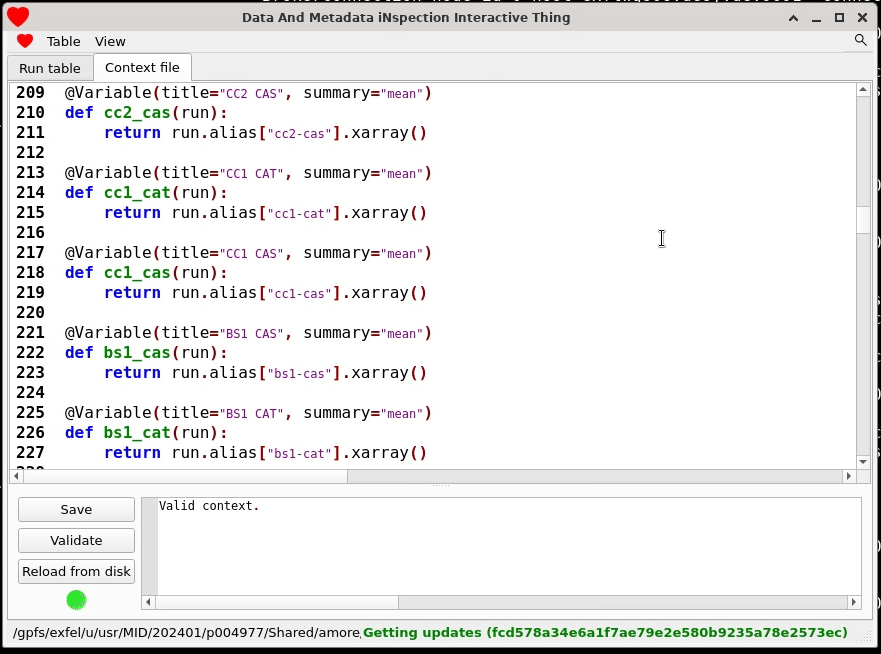

# The backend and context file
The backend runs a context file like this one, which contains functions that
it will execute:
```python title="context.py" linenums="1"
import numpy as np
from damnit_ctx import Variable

xgm_name = "SA2_XTD1_XGM/XGM/DOOCS"

@Variable(title="XGM intensity [uJ]", summary="mean")
def xgm_intensity(run):
    """
    Mean XGM intensity per-train.
    """
    xgm = run[f"{xgm_name}:output", 'data.intensityTD'].xarray()
    return xgm[:, np.where(xgm[0] > 1)[0]].mean(axis=1)

@Variable(title="Pulses")
def pulses(run):
    """
    Number of pulses in the run.
    """
    return run[xgm_name, 'pulseEnergy.numberOfBunchesActual'].as_single_value()
```

By convention it's stored under the `usr/Shared/amore` directory of a proposal,
along with other files that DAMNIT creates like the SQLite database and the HDF5
files that are created for each run.

When you open a database in the GUI the context file will be available in the
`Context file` tab:



You can edit the file in that tab, and before every save the editor will
validate the file. There are two kinds of problems you can have:

- Errors (syntax errors, etc), in which case the editor will *not* save the file.
- Warnings from [pyflakes](https://pypi.org/project/pyflakes/). Sometimes
  pyflakes will give warnings that can be safely ignored, so they will not block
  the editor from saving the file (though you should try to fix all the
  warnings, pyflakes almost never reports false positives).

## `@Variable`'s
Functions in the context file can be decorated with `@Variable` to denote that
these are variables to be executed for each run. The `@Variable` decorator takes
these arguments:

- `title` (string): title displayed for the variable's column.
- `summary` (string): if the function returns an array, then `summary` will be used to
  reduce it to a single number. Internally it gets mapped to `np.<summary>()`,
  so you can use e.g. `sum` or `nanmean` to compute the summary with `np.sum()`
  or `np.nanmean()` respectively.
- `data` (string): this sets the trigger for the variable. By default
  `Variable`'s have `data="raw"`, which means they will be triggered by a
  migration of raw data to the offline cluster. But if you want to process
  detector data which requires calibration, then you'll want to set
  `data="proc"` to tell DAMNIT to run that `Variable` when the calibration
  pipeline finishes processing the run:
  ```python
  @Variable(title="Detector preview", data="proc")
  def detector_preview(run):
      ...
  ```
- `cluster` (bool): whether or not to execute this variable in a Slurm job. This
  should always be used if the variable does any heavy processing.

Variable functions can return any of:

- Scalars
- Lists of scalars
- Multi-dimensional `numpy.ndarray`'s or `xarray.DataArray`'s (2D arrays will be
  treated as images)
- Strings
- `None`

The functions must always take in one argument, `run`, to which is passed a
[`DataCollection`](https://extra-data.readthedocs.io/en/latest/reading_files.html#data-structure)
of the data in the run.  In addition, a function can take some other special
arguments if they have the right _annotations_:

- `meta#run_number`: The number of the current run being processed.
- `meta#proposal`: The number of the current proposal.
- `meta#proposal_dir`: The root
  [Path](https://docs.python.org/3/library/pathlib.html) to the current
  proposal.
- `mymdc#sample_name`: The sample name from myMdC.
- `mymdc#run_type`: The run type from myMdC.

!!! warning
    The myMdC integration requires a special token to work properly, please
    contact the DA group if you would like to use this for your experiment.

You can also use annotations to express a dependency between `Variable`'s using
the `var#<name>` annotation:
```python
@Variable(title="foo")
def foo(run, run_no: "meta#run_number"):
    # Just return the run number
    return run_no
    
@Variable(title="bar")
def bar(run, value: "var#foo"):
    # Now bar() will be executed after foo(), and we can use its return value
    return value * 2
```

Dependencies with default values are also allowed, the default value will be
passed to the function if the dependency did not complete execution for some
reason:
```python
@Variable(title="baz")
def baz(run, value: "var#foo"=42):
    # This will return the result of foo() if foo() succeeded, otherwise 42
    return value
```

## Using Slurm
As mentioned in the previous section, variables can be marked for execution in a
Slurm job with the `cluster=True` argument to the decorator:
```python
@Variable(title="Foo", cluster=True)
def foo(run):
    # some heavy computation ...
    return 42
```

This should work out-of-the-box with no other configuration needed. By default
DAMNIT will figure out an appropriate partition that user has access to, but
that can be overridden by explicitly setting a partition or reservation:
```bash
# Set a reservation
$ amore-proto db-config slurm_reservation upex_001234

# Set a partition
$ amore-proto db-config slurm_partition allgpu
```

If both `slurm_reservation` and `slurm_partition` are set, the reservation will
be chosen. The jobs will be named something like `r42-p1234-damnit` and the logs
will be saved to files named `r42-p1234-<jobid>.out` (containing both stdout and
stderr) in the `slurm_logs/` directory.

!!! note

    Make sure to delete the reservation setting after the reservation has
    expired, otherwise Slurm jobs will fail to launch.

    ```bash
    $ amore-proto db-config slurm_reservation --delete
    ```

## Reprocessing
The context file is loaded each time a run is received, so if you edit the
context file the changes will only take effect for the runs coming later. But,
it is possible to reprocess runs using a command line tool:
```bash
$ module load exfel amore
$ amore-proto reprocess -h
usage: amore-proto reprocess [-h] [--mock] [--proposal PROPOSAL] [--match MATCH] run [run ...]

positional arguments:
  run                  Run number, e.g. 96. Multiple runs can be specified at once, or pass 'all' to reprocess all runs in the database.

options:
  -h, --help           show this help message and exit
  --mock               Use a fake run object instead of loading one from disk.
  --proposal PROPOSAL  Proposal number, e.g. 1234
  --match MATCH        String to match against variable titles (case-insensitive). Not a regex, simply `str in var.title`.
```

Note that you *must* run the tool from a database directory
(`usr/Shared/amore`). Here are some examples of using it:
```bash
# Reprocess all variables for a single run
$ amore-proto reprocess 100

# Reprocess all variables with a title matching 'agipd' for a single run
$ amore-proto reprocess 100 --match agipd

# Reprocess variables for multiple runs
$ amore-proto reprocess 1 10 100 --match agipd

# Reprocess variables for a sequence of runs
$ amore-proto reprocess $(seq 1 100) --match agipd

# Reprocess all variables for all runs
$ amore-proto reprocess all
```

## Using custom environments
DAMNIT supports running the context file in a user-defined Python environment,
which is handy if there's a certain package you want that's only installed in
a certain environment. At some point the setting for this will be exposed
in the GUI, but right now you'll have to change it on the command line by
passing the path to the `python` executable of the required environment:
```bash
$ amore-proto db-config context_python /path/to/your/python
```

The environment *must* have these dependencies installed for DAMNIT to work:

- `extra_data`
- `pyyaml`
- `requests`
- `scipy`

## Managing the backend
The backend is a process running under [Supervisor](http://supervisord.org/). In
a nutshell:

- Supervisor will manage the backend using a configuration file named
  `supervisord.conf` stored in the database directory. It's configured to listen
  for commands over HTTP on a certain port with a certain
  username/password. Supervisor will save its logs to `supervisord.log`.
- It can be controlled with `supervisorctl` on any machine using the same config
  file.

So lets say you're running the GUI on FastX, and the backend is now started. If
you open a terminal and cd to the database directory you'll see:
```bash
$ cd /gpfs/path/to/proposal/usr/Shared/amore
$ ls
amore.log  context.py  extracted_data/  runs.sqlite  supervisord.conf supervisord.log
```

You could get the status of the backend with:
```bash
$ supervisorctl -c supervisord.conf status damnit
damnit                           RUNNING   pid 3793870, uptime 0:00:20
```

And you could restart it with:
```bash
$ supervisorctl -c supervisord.conf restart damnit
damnit: stopped
damnit: started

$ supervisorctl -c supervisord.conf status damnit
damnit                           RUNNING   pid 3793880, uptime 0:00:04
```

## Starting from scratch
Sometimes it's useful to delete all of the data so far and start from scratch,
for example if there are some variables you want to delete (though deleting
variables will be implemented soon™©®). As long as you have the context file
this is safe, with the caveat that comments and user-editable variables _cannot_
be restored.

The steps to delete all existing data are:

1. `rm runs.sqlite` to delete the database used by the GUI.
1. `rm -rf extracted_data/` to delete the HDF5 files created by the backend.
1. `amore-proto proposal 1234` to create a blank database for the given
   proposal.

And then you can reprocess runs with `amore-proto reprocess` to restore
their data.
