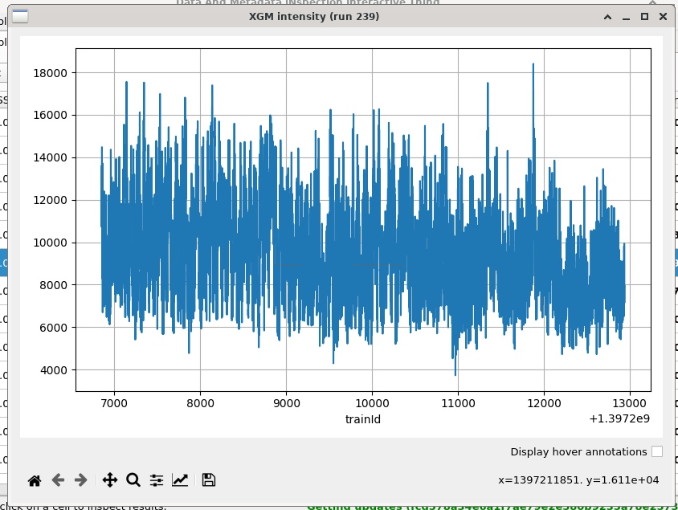
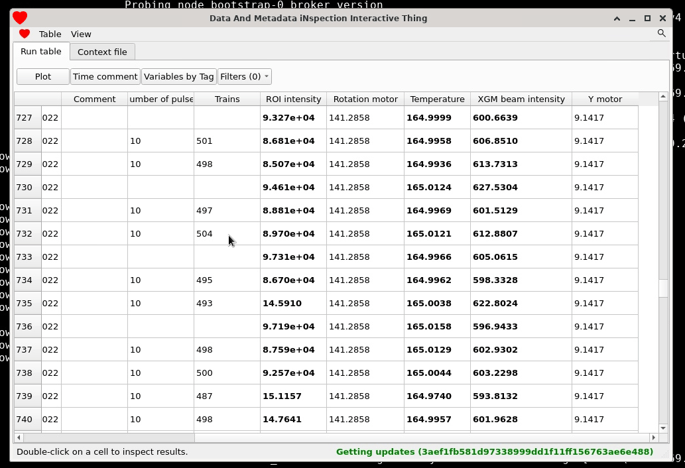

# GUI

## Open the GUI
1. Start by opening a [FastX](https://max-exfl-display.desy.de:3389) XFCE
   session. You can also SSH to `max-exfl.desy.de` with X forwarding enabled
   but that's not recommended because it can be slow.
2. Open a terminal and run:
   ```bash
   $ module load exfel amore
   $ amore-proto gui
   ```
3. If you want to work with the shared database for a proposal you can enter the
   proposal number directly (it will prompt you to create one if it doesn't
   already exist):
   

   Otherwise if you're playing around and want to make a test database, you can
   create one manually like this:

```bash
# Make a directory for the database
$ mkdir mydb
$ cd mydb

# Initialize the database for a certain proposal
$ amore-proto proposal 1234
# Start the backend and create a default context file
$ amore-proto listen . --daemonize

# Start the GUI
$ amore-proto gui .
```

## Exploring variables
The interface is organized around a central table of runs that contain
*variables*, which are the things computed by the functions in the context file
(or entered by users). Each variable gets its own column, and variables can be
hidden or shown with the checkboxes on the right.

Features:

- Hide/show and move columns using the controls on the right:
  
- To add a comment about a specific run (e.g. "Very good signal, we're really
  nailing this science thing."), click and edit its `Comment` column.
- To add an additional comment not related to a specific run (e.g. "Beam went
  down. Devastated."), write something in the text input widget at the bottom
  and click the `Additional comment` button. These comments are arranged by
  time, which you can also adjust before adding one.
- Variables are 'summarized' in the table but they can be arrays. If you
  double-click on a variable for a row and it has train-resolved data, it will
  be plotted. For example if you double-click on a variable for the XGM
  intensity of a run, you might see something like:
  

- To plot one variable vs another, select some variables in the bottom right
  hand corner and click one of the plotting buttons:
  
  Click the 'vs.' button to swap the axes. The `Plot summary for all runs`
  button will plot summary variables vs each other, for example you can plot the
  run number vs the XGM intensity to see a plot of the beam intensity over the
  experiment.
  

- But you can also plot variables with train-resolved data against each other
  within a certain run, which could be useful to visualize scans:
  
- There is also some (very basic) support for histogramming single variables
  with the `Histogram` button (click to enable/disable it):
  

## Adding user-editable variables
Ideally it would be possible to define all variables as code, but sometimes
that's just not possible. Hence, DAMNIT allows you to create user-editable
variables straight from the GUI which you can edit directly. This is good for
anything that cannot be computed automatically from saved files, such as sample
information or a note about the run.

You can add a user-editable variable from the menu in the top left:

