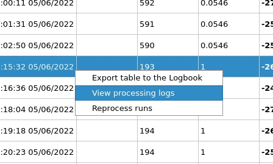

# GUI

## Open the GUI
1. Start by opening a [FastX](https://max-exfl-display.desy.de:3389) XFCE
   session. You can also SSH to `max-exfl-display.desy.de` with X forwarding
   enabled but that's not recommended because it can be slow.
2. Open a terminal and run:
   ```bash
   $ module load exfel damnit
   $ damnit gui

   # Alternatively, if you already know you want proposal 1234
   $ damnit gui 1234
   ```
3. If you didn't specify a proposal you can enter the proposal number or choose
   a directory that contains a DAMNIT database (it will prompt you to create one
   if one doesn't already exist):
   

??? note "Creating databases from the terminal"

    This is not recommended for most users, but it is possible to create a
    database and start the backend using `damnit` commands:
    ```bash
    # Make a directory for the database
    $ mkdir mydb
    $ cd mydb

    # Initialize the database for an XMPL proposal (example proposal with open data)
    $ damnit proposal 700000
    # Start the backend and create an empty context file
    $ damnit listen . --daemonize

    # Start the GUI
    $ damnit gui .
    ```

## Exploring variables
The interface is organized around a central table of runs that contain
*variables*, which are the things computed by the functions in the context file
(or entered by users). Each variable gets its own column, and variables can be
hidden or shown with the checkboxes on the right.

Features:

- Hide/show and move columns using the settings under `Table` >> `Select, delete, &
  reorder columns`:
  

- To add a comment about a specific run (e.g. "Very good signal, we're really
  nailing this science thing."), click and edit its `Comment` column:
  

- Variables are 'summarized' in the table but they can be arrays. If you
  double-click on a variable for a row and it has train-resolved data, it will
  be plotted. For example if you double-click on a variable for the XGM
  intensity of a run, you might see something like this:
  

- To plot one variable vs another, click the `Plot` button, select some
  variables, and click one of the plotting buttons. The `Plot summary for all
  runs` button will plot summary variables vs each other, for example you can
  plot the run number vs the XGM intensity to see a plot of the beam intensity
  over the experiment.
  

- But you can also plot variables with train-resolved data against each other
  within a selection of runs, which could be useful to visualize scans:
  

- There is also some (very basic) support for histogramming single variables
  with the `Histogram` button (click to enable/disable it):
  

- The runs in the table can be filtered by the values in the columns:
  

- The table's `Cells` can be highlighted with custom background colors and text
  formatting for emphasis, see [Cell configuration](backend.md#cell) for more
  information.

## Editing the context file
When you open a database in the GUI the context file will be available in the
`Context file` tab:


You can edit the file in that tab, and before every save the editor will
validate the file. There are two kinds of problems you can have:

- Errors (syntax errors, etc), in which case the editor will *not* save the file.
- Warnings from [pyflakes](https://pypi.org/project/pyflakes/). Sometimes
  pyflakes will give warnings that can be safely ignored, so they will not block
  the editor from saving the file (though you should try to fix all the
  warnings, pyflakes almost never reports false positives).


## Reprocessing and logs
The context file is loaded each time a run is received, so if you edit the
context file the changes will only take effect for the runs coming later. But if
you want to reprocess runs you can always do so through the GUI:


Note that processing indicators will appear in the run number column on the left
side to show which runs are processing.

The processing logs are all stored in the `process_logs/` directory of DAMNIT,
and they can be viewed in the GUI by right-clicking a run and selecting `View
processing logs`:



??? note "Reprocessing from the terminal"
    For those who prefer a terminal-based workflow, it's also possible to
    reprocess runs with the `damnit reprocess` command.

    Note that you *must* run the tool from a database directory
    (`usr/Shared/amore`). Here are some examples of using it:
    ```bash
    # Reprocess all variables for a single run
    $ damnit reprocess 100

    # Reprocess all variables with a title matching 'agipd' for a single run
    $ damnit reprocess 100 --match agipd

    # Reprocess variables for multiple runs
    $ damnit reprocess 1 10 100 --match agipd

    # Reprocess variables for a sequence of runs
    $ damnit reprocess $(seq 1 100) --match agipd

    # Reprocess all variables for all runs in the database
    $ damnit reprocess all
    ```

## Adding user-editable variables
Ideally it would be possible to define all variables as code, but sometimes
that's just not possible. Hence, DAMNIT allows you to create user-editable
variables straight from the GUI which you can edit directly. This is good for
anything that cannot be computed automatically from saved files, such as sample
information or a note about the run.

You can add a user-editable variable from the menu in the top left:


## Tag Filtering
Variables can be tagged in the context file to organize them into logical groups
(e.g., by detector, data type, or processing stage). The GUI provides an easy
way to filter variables based on these tags by using the `Variables by Tag`
button.


Tags are preserved in the database and are automatically updated when you modify
them in the context file. For information on how to define tags for variables,
see the [Variables](backend.md#variables) section.

## Exporting
All the data in the run table can be exported to an Excel/CSV file, with the
caveat that images will not be exported (they'll be replaced with an `<image>`
string):


## Experimental: the web interface
To make accessing the GUI easier we're working on a web interface to replace the
current PyQt GUI. This is still very much in beta, but if you're feeling brave
you can try it out through this link: https://damnit-dev.xfel.eu/


Currently it can only be accessed within our internal network so you'll need to
have a VPN or proxy set up. Note that not all features have been ported from the
PyQt GUI yet.
