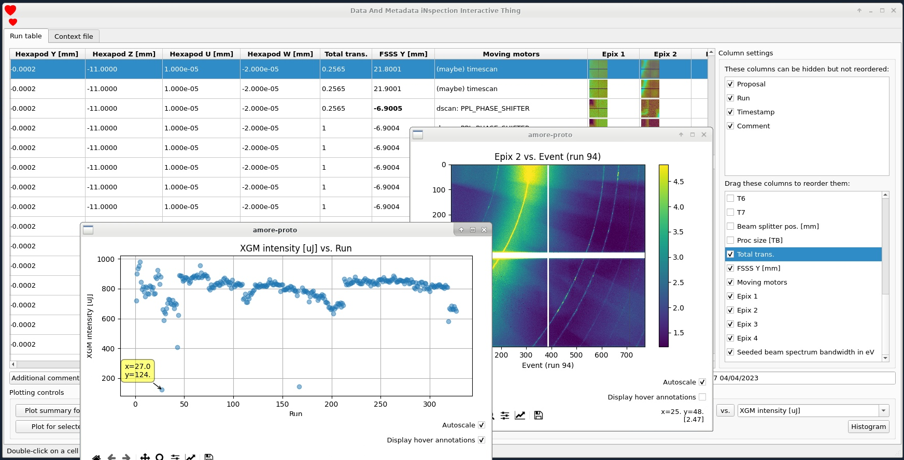

# DAMNIT

Welcome to the DAMNIT user documentation! The name 'DAMNIT' is
definitely-not-a-backronym for *Data And Metadata iNspection Interactive
Thing*. It's a tool developed by the [Data Analysis
group](https://www.xfel.eu/data_analysis) at the European XFEL to provide users
with a way to automatically create an overview of their experiment, hopefully
replacing the manually-created spreadsheets that are often used.

If you want to access the data created by DAMNIT, check out our [API](api.md).

Sneak peak:

Note: DAMNIT was previously named AMORE, and there still places in the
application where you'll see this name used instead of DAMNIT.

## Design overview
There are two parts to DAMNIT: the frontend GUI and the backend. The GUI is
currently written in PyQt but we're in the process of moving to a [web
interface](getting-started.md#open-the-gui). The backend is a service that runs
on XFEL's offline cluster for each proposal, so one instance of the backend for
one proposal is completely separate from any others and can be started by any
user.

To fill up the table you see in the screenshot above, the backend executes what
we call a *context file*, which is simply a Python file that contains *variable*
definitions. A *variable* in DAMNIT is a 'thing' that you want to track during
the experiment, and the values for each variable for each run can either be
generated automatically [from the context
file](configuration_and_management.md), or entered manually [into the
GUI](getting-started.md#adding-user-editable-variables).

When a new run is taken, the files are migrated from the online cluster to the
offline cluster and this triggers the backend to execute any variables in the
context file that use `raw` data. If calibrated data is used, the offline
calibration pipeline will also trigger the backend to execute any variables that
require `proc` data. When the variables are processed they will be saved in
DAMNIT's internal database, and in HDF5 files (which may be used directly by the
user).

Whenever the backend finishes processing some variables it sends updates to any
open GUIs, so the effect is that you see an automatically-updating table of
runs with variables coming from code that you can modify in the context file;
which gives an enormous amount of flexibility to customize the variables for
your experiment.

# Acknowledgements

This work is partially supported by the consortium
[DAPHNE4NFDI](https://www.daphne4nfdi.de/) in the context of the work of the
[NFDI e.V.](https://www.nfdi.de/). The consortium is funded by the Deutsche
Forschungsgemeinschaft ([DFG](https://www.dfg.de/), German Research Foundation)
- project number 460248799.
